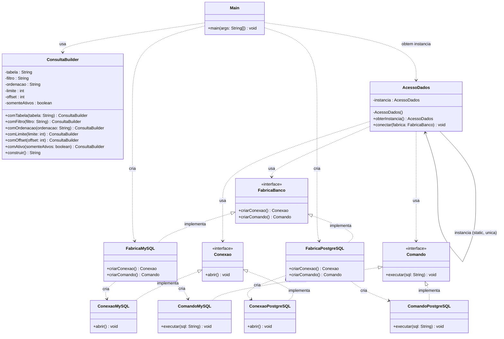

# Diagrama de classes — Etapa 5

```mermaid
classDiagram
    class Conexao {
        <<interface>>
        +abrir() void
    }
    class Comando {
        <<interface>>
        +executar(sql: String) void
    }
    class ConexaoMySQL {
        +abrir() void
    }
    class ComandoMySQL {
        +executar(sql: String) void
    }
    class ConexaoPostgreSQL {
        +abrir() void
    }
    class ComandoPostgreSQL {
        +executar(sql: String) void
    }

    class FabricaBanco {
        <<interface>>
        +criarConexao() Conexao
        +criarComando() Comando
    }
    class FabricaMySQL {
        +criarConexao() Conexao
        +criarComando() Comando
    }
    class FabricaPostgreSQL {
        +criarConexao() Conexao
        +criarComando() Comando
    }

    class ConsultaBuilder {
        -tabela : String
        -filtro : String
        -ordenacao : String
        -limite : int
        -offset : int
        -somenteAtivos : boolean
        +comTabela(tabela: String) ConsultaBuilder
        +comFiltro(filtro: String) ConsultaBuilder
        +comOrdenacao(ordenacao: String) ConsultaBuilder
        +comLimite(limite: int) ConsultaBuilder
        +comOffset(offset: int) ConsultaBuilder
        +comAtivo(somenteAtivos: boolean) ConsultaBuilder
        +construir() String
    }

    class AcessoDados {
        -instancia : AcessoDados
        -AcessoDados()
        +obterInstancia() AcessoDados
        +conectar(fabrica: FabricaBanco) void
    }

    class Main {
        +main(args: String[]) void
    }

    Conexao <|.. ConexaoMySQL : implementa
    Conexao <|.. ConexaoPostgreSQL : implementa
    Comando <|.. ComandoMySQL : implementa
    Comando <|.. ComandoPostgreSQL : implementa

    FabricaBanco <|.. FabricaMySQL : implementa
    FabricaBanco <|.. FabricaPostgreSQL : implementa

    FabricaMySQL ..> ConexaoMySQL : cria
    FabricaMySQL ..> ComandoMySQL : cria
    FabricaPostgreSQL ..> ConexaoPostgreSQL : cria
    FabricaPostgreSQL ..> ComandoPostgreSQL : cria

    AcessoDados ..> FabricaBanco : usa
    AcessoDados ..> Conexao : usa
    AcessoDados ..> Comando : usa
    AcessoDados --> AcessoDados : instancia (static, unica)

    Main ..> AcessoDados : obtem instancia
    Main ..> FabricaMySQL : cria
    Main ..> FabricaPostgreSQL : cria
    Main ..> ConsultaBuilder : usa
```

